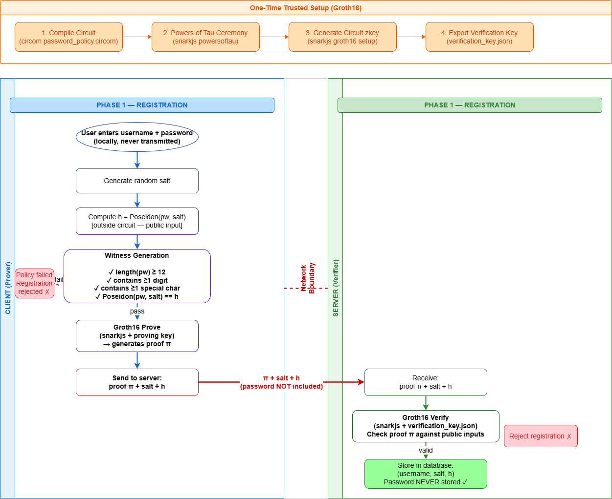
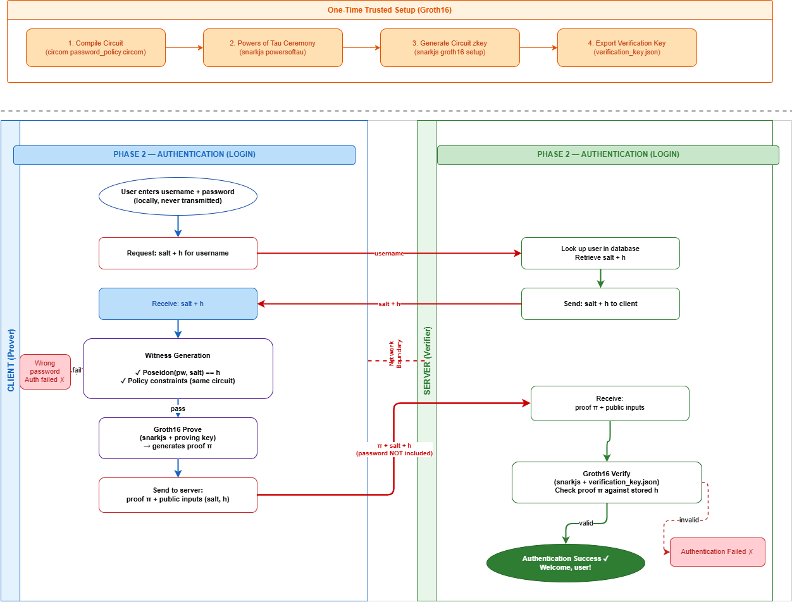

# Zero-Knowledge Proof Based Password Authentication and Policy Enforcement

---

## Overview

Password-based authentication is widely used in modern systems, but it typically requires users to send their password to a server for verification. Even when passwords are securely stored (e.g., hashed), the server still receives the raw password during login or registration. This creates a potential point of exposure, especially in the case of server compromise, logging issues, or implementation flaws. Password-based authentication protocols such as SRP and OPAQUE (Password Authenticated Key Exchange — PAKE) address the transmission security problem by ensuring that the password never travels over the network. 

This project implements a zero-knowledge proof based mechanism that fills this gap. Using a Groth16 zk-SNARK over a Circom arithmetic circuit, a client can prove to a server that their password satisfies a defined policy (minimum length, digit, special character) **and** correctly corresponds to a stored Poseidon hash commitment — without ever transmitting or revealing the password itself. This serves as a cryptographic building block that can be integrated into PAKE-based authentication systems to enforce password policy at the protocol level. The project demonstrates how zero-knowledge techniques can be used to enforce password policies and verify correctness in a privacy-preserving manner.

---

## ZK Proof Background

### What is a zk-SNARK?

A zk-SNARK (Zero-Knowledge Succinct Non-interactive Argument of Knowledge) is a cryptographic proof system in which a prover can convince a verifier that they know a secret witness satisfying some predicate, without revealing the witness. "Succinct" means the proof is short (a few hundred bytes) and fast to verify regardless of the complexity of the computation. And, "Non-interactive" means the proof can be sent as a single message. Groth16 is a specific zk-SNARK construction based on bilinear pairings over elliptic curves (BN128), producing the smallest known proofs with only 3 group elements.

### What the Circuit Proves

The prover convinces the verifier that they know a secret password `pw` such that:

- `length(pw) >= 12` (minimum length policy)
- `pw` contains at least one ASCII digit (characters `0`–`9`, codes 48–57)
- `pw` contains at least one special character from `!@#$%^&*` (ASCII 33, 64, 35, 36, 37, 94, 38, 42)
- `Poseidon(pw[0..31], salt) == h` — the password correctly maps to the stored commitment

**Private inputs (witness):** `pw[32]` (zero-padded ASCII array), `L` (actual length)  
**Public inputs:** `salt`, `h` (commitment)

### Why This is Zero-Knowledge

The verifier checks only the proof `π` against the public inputs `(salt, h)`. The proof reveals no information about `pw` beyond the fact that it satisfies the above four properties — this follows from the zero-knowledge property of Groth16.

---


## System Architecture


### Registration




### Authentication



---

## Password Policy

| Requirement | Detail |
|---|---|
| Minimum length | 12 characters |
| Digit | At least 1 character from `0`–`9` (ASCII 48–57) |
| Special character | At least 1 from `!@#$%^&*` (ASCII 33, 64, 35, 36, 37, 94, 38, 42) |
| Maximum length | 32 characters (fixed circuit size — padded with zeros) |

All policy rules are enforced **inside the ZK circuit** as arithmetic constraints. A password that does not satisfy the policy cannot produce a valid proof, regardless of what the client claims.

---

## Installation

### Prerequisites

```bash
# 1. Install Node.js LTS (Windows)
#    Download from: https://nodejs.org/en/download/
#    Choose LTS version, run the installer

# 2. Install Rust (required for circom)
#    Download from: https://rustup.rs/

# 3. Install Circom
git clone https://github.com/iden3/circom.git
cd circom
cargo build --release
cargo install --path circom
cd ..

# 4. Install snarkjs globally
npm install -g snarkjs

# 5. Clone this repository
git clone https://github.com/rakin061/zk-password-auth.git
cd zk-password-auth

# 6. Install project dependencies
npm install
```

---

## Setup (One-Time)

Run the trusted setup pipeline once before using the system.

**On Linux/macOS:**
```bash
bash scripts/setup.sh
```

**On Windows (PowerShell):**
```powershell
Set-ExecutionPolicy -ExecutionPolicy RemoteSigned -Scope CurrentUser
.\scripts\setup.ps1
```

The setup script performs:
1. Compile `password_policy.circom` → R1CS + WASM
2. Powers of Tau Phase 1 (bn128 14 — 2^14 = 16,384 constraint capacity)
3. Phase 1 contribution
4. Prepare Phase 2
5. Groth16 circuit-specific zkey generation
6. Phase 2 contribution + export `setup/verification_key.json`

**Note:** `bn128 14` is used instead of `bn128 12` because Poseidon + policy constraints together require ~2,000–3,000 constraints, which exceeds the safe capacity of `bn128 12`.

Generated files (gitignored — do not commit):
- `setup/pot14_final.ptau` (~100MB)
- `setup/circuit_final.zkey` (~50MB)

Committed file:
- `setup/verification_key.json` — required for verification, small (~2KB)

---

## Usage

### Register a new user

```bash
node scripts/register.js
```

```
[ZK-AUTH] Zero-Knowledge Password Registration
[ZK-AUTH] =====================================
Enter username: alice
Enter password: MyPassword1!xyz
[ZK-AUTH] Generating salt...
[ZK-AUTH] Computing Poseidon commitment...
[ZK-AUTH] Generating witness...
[ZK-AUTH] Generating Groth16 proof...
[ZK-AUTH] Verifying proof...
[ZK-AUTH] ✓ Password policy verified in zero knowledge.
[ZK-AUTH] ✓ Registration successful. User 'alice' stored.
[ZK-AUTH] Proof size: 794 bytes | Proving time: 2341ms | Verification time: 18ms
```

If the password fails policy (e.g., no digit):
```
[ZK-AUTH] ✗ Witness generation failed: password does not satisfy policy constraints.
[ZK-AUTH] ✗ Registration rejected.
```

### Authenticate

```bash
node scripts/login.js
```

```
[ZK-AUTH] Zero-Knowledge Password Authentication
[ZK-AUTH] ========================================
Enter username: alice
Enter password: MyPassword1!xyz
[ZK-AUTH] Loading commitment for user 'alice'...
[ZK-AUTH] Generating witness...
[ZK-AUTH] Generating Groth16 proof...
[ZK-AUTH] Verifying proof...
[ZK-AUTH] ✓ Authentication successful. Welcome, alice.
[ZK-AUTH] Proof size: 794 bytes | Proving time: 2341ms | Verification time: 18ms
```

---

## Running Tests

```bash
node test/run_tests.js
```

Tests cover 7 scenarios:

```
[TEST 1] Valid password registration............. PASS ✓
[TEST 2] Too short password rejected............. PASS ✓
[TEST 3] No digit rejected....................... PASS ✓
[TEST 4] No special character rejected........... PASS ✓
[TEST 5] Correct password login succeeds......... PASS ✓
[TEST 6] Wrong password login rejected........... PASS ✓
[TEST 7] Unknown username rejected............... PASS ✓

7/7 tests passed.
```

---

## Project Structure

```
zk-password-auth/
├── circuits/
│   └── password_policy.circom      ← ZK circuit (Groth16 over BN128)
├── scripts/
│   ├── register.js                 ← Registration CLI
│   ├── login.js                    ← Authentication CLI
│   ├── helpers.js                  ← Shared utilities (encoding, DB, metrics)
│   ├── poseidon_hash.js            ← Outside-circuit Poseidon (mirrors circuit)
│   ├── setup.sh                    ← Trusted setup (Linux/macOS)
│   └── setup.ps1                   ← Trusted setup (Windows PowerShell)
├── setup/
│   ├── verification_key.json       ← Public verifier key (committed)
│   └── README.txt                  ← Documents setup artifacts
├── build/
│   └── README.txt                  ← Documents build artifacts
├── db/
│   └── users.json                  ← Simulated user database
├── proofs/                         ← Generated proofs (gitignored)
├── test/
│   └── run_tests.js                ← 7-case automated test suite
├── docs/
│   └── workflow.drawio             ← System workflow diagram
├── package.json
├── .gitignore
└── README.md
```

---

## Limitations

- **Trusted setup:** This implementation uses a single-party local setup for proof-of-concept purposes. In production, a multi-party computation (MPC) ceremony would be required to ensure no single party retains the "toxic waste" (the secret tau used in the Powers of Tau ceremony). If the toxic waste is known, fake proofs can be generated.
- **Fixed maximum password length:** The circuit uses a fixed 32-character width. Passwords longer than 32 characters are rejected at the client before reaching the circuit.
- **Policy re-verification at login:** The same circuit is used for both registration and authentication, meaning policy constraints run at every login. A production system would use a separate, lighter authentication circuit checking only the hash commitment.
- **Does not implement full PAKE:** This project is a cryptographic building block. It does not implement the full OPAQUE or SRP protocol — it provides the ZK policy enforcement component that would be integrated into such a system.
- **Offline brute-force on commitment:** If the `users.json` database is compromised, an attacker can attempt to brute-force the password offline by computing `Poseidon(pw, salt)` for candidate passwords. The ZK proof does not protect against this — resistance requires a sufficiently large password space (strong passwords).
- **Non-production cryptography:** The Poseidon parameters used are from `circomlib`, which targets the BN128 field. These are well-reviewed but should be validated against the latest cryptanalysis before production use.

---

## Future Work

- Integration with a full PAKE protocol (OPAQUE or SRP) where this ZK proof serves as the policy enforcement layer at registration
- Separate registration and authentication circuits to remove redundant policy checking from the login path
- Multi-party trusted setup ceremony (e.g., using snarkjs MPC tools)
- Web interface with browser-side proving (using snarkjs in the browser)
- Threshold signature scheme for the server-side commitment storage

---

## References

<a name="references"></a>

- **[Groth16]** Groth, J. (2016). *On the Size of Pairing-Based Non-interactive Arguments*. EUROCRYPT 2016. [https://eprint.iacr.org/2016/260](https://eprint.iacr.org/2016/260)
- **[Poseidon]** Grassi, L., Khovratovich, D., Rechberger, C., Roy, A., & Schofnegger, M. (2021). *Poseidon: A New Hash Function for Zero-Knowledge Proof Systems*. USENIX Security 2021. [https://eprint.iacr.org/2019/458](https://eprint.iacr.org/2019/458)
- **[Circom]** iden3. *Circom 2.0 Documentation*. [https://docs.circom.io](https://docs.circom.io)
- **[snarkjs]** iden3. *snarkjs: zk-SNARK implementation in JavaScript*. [https://github.com/iden3/snarkjs](https://github.com/iden3/snarkjs)
- **[circomlib]** iden3. *circomlib: Circuit library for Circom*. [https://github.com/iden3/circomlib](https://github.com/iden3/circomlib)
- **[PAKE]** Van Oorschot, P. C. (2021). *Computer Security and the Internet: Tools and Jewels* (2nd ed.). Springer. Chapter 4 (Password Protocols and PAKE).
- **[OPAQUE]** Bourdopoulos, A., et al. *The OPAQUE Asymmetric PAKE Protocol*. IETF RFC Draft. [https://datatracker.ietf.org/doc/draft-irtf-cfrg-opaque/](https://datatracker.ietf.org/doc/draft-irtf-cfrg-opaque/)
